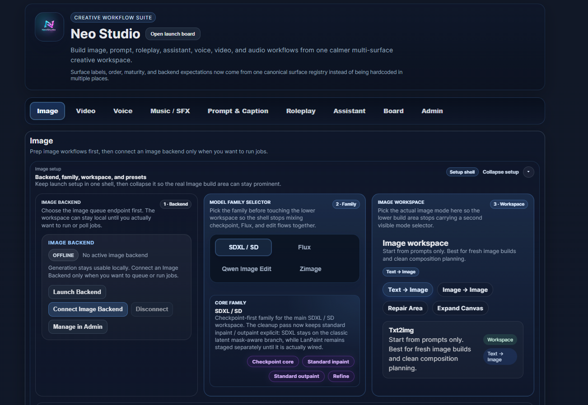

# Neo Studio

**Neo Studio** is a local-first AI creative workspace and frontend control system designed to connect multiple AI backends—such as ComfyUI, KoboldCPP, and other local tools—into one structured environment.

Neo Studio does not include AI models or backend engines by itself. Instead, it provides an organized interface for managing creative workflows like image generation, prompt engineering, roleplay systems, assistant tools, and backend launching.

Instead of juggling separate tools manually, Neo Studio helps connect and organize them so creators can focus on building, testing, and refining their workflows.


---

## ✨ Features

* 🎨 **[Image Tab](docs/IMAGE_TAB_GUIDE.md)**

  * Structured workflows for image generation and refinement
  * Supports ControlNet, ADetailer, IPAdapter, Scene Director, RES4LYF, LanPaint, and advanced pipelines
* 🧩 **[Board](docs/BOARD_TAB_GUIDE.md)**

  * Visual canvas for planning ideas and workflows
  * Sticky notes, media cards, checklist linking
* ✍️ **[Caption & Prompt](docs/PROMPT_CAPTION.md)**

  * Generate, refine, and manage prompts and captions
  * Bridge outputs directly into assistant workflows
* 🎭 **[Roleplay System](docs/ROLEPLAY_GUIDE.md)**

  * **Forge** – Create characters, worlds, universes, legends, and structured entities
  * **Scene** – Live roleplay and novel-writing environment
  * **Stories** – Workspace, storyline, archive, and inspector tools
  * **Studio** – Guide, Project, Source, Assist, Advanced, Libraries, Compile, Runtime, Engine, and Inspector controls
* 🤖 **[Assistant](docs/ASSISTANT_GUIDE.md)**

  * Chat-based workflow with memory and context support
* ⚙️ **Admin**

  * Launch and manage local backends such as ComfyUI and KoboldCPP
  * Install required ComfyUI custom nodes through Neo's node manager

---

## 🚧 Project Status

Neo Studio is currently in **V1 (active development)**.

* Core systems are functional and usable
* Some features are still being refined
* Structure and workflows may evolve over time

Ongoing improvements focus on:

* Stability and performance
* Workflow clarity and usability
* Better integration between systems
* Expanded feature support

---

## 🛠️ Update
**May/09/2026 - Image Tab**

| Flux + Qwen GGUF | ✅ GGUF Workflow Recovery Fix | Fixed an issue where GGUF models were not properly loading or appearing under the Flux and Qwen workflow families due to loader alias detection, catalog separation, and workflow routing regressions. Restored GGUF model visibility, mmproj discovery, payload validation, and workflow compatibility across user repositories. |

**May/08/2026 - Image Tab**

| System | Update | Details |
|---|---|---|
| Scene Director | ✅ Global Prompt Routing Fix | Fixed Scene Director prompt handling so the Neo positive prompt and Style Stack output route into the effective Scene Director global context instead of being ignored or disconnected from the active sampler path. Node Updated |
| Scene Director + IPAdapter | ✅ Regional Identity Binding Fix | Fixed regional FaceID/IPAdapter routing so character profiles assigned to Scene Director regions can apply identity conditioning through the correct regional mask instead of falling back to global or empty routing. |
| LoRA Stack | ✅ Regional Apply-To Fix | Fixed the LoRA Stack **Apply to** dropdown so Scene Director regions can appear as selectable targets, allowing LoRAs to be applied to a specific region instead of only globally. |
| Scene Director + LoRA | ✅ Regional LoRA Workflow Fix | Fixed regional LoRA workflow routing so selected region LoRAs are applied through a masked regional pass rather than affecting the full image globally. |

**May/06/2026 - Image Tab**

| System | Update | Details |
|---|---|---|
| Tag Assist | ✅ Startup Fix | Fixed a backend startup issue where Tag Assist could fail because its options state was not initialized correctly. |
| Style Stack | ✅ CSV Loading Fix | Improved the Style Stack CSV decoder so user style files load more reliably, including files with non-standard text encoding. |
| Caption Browser | ✅ Prompt Handoff Fix | Fixed prompt handoff from Caption Browser to the main Positive Prompt field. Added a safer draft merge lock so injected prompts are not immediately overwritten by preset or draft refresh logic. |
| ControlNet | ✅ Layout Fix | Fixed extra ControlNet units added with **+ Add ControlNet** so they no longer collapse into a narrow left-side column. Improved unit wrapping, card width, and layout behavior. |
| Scene Director + IPAdapter | ✅ Workflow Routing Fix | Improved Scene Director workflow handling so global IPAdapter can be suppressed before graph build when Scene Director uses its own identity/reference routing. Helps prevent duplicate IPAdapter conditioning conflicts. |
| Workspace Presets | ✅ Backend Storage Migration | Workspace Presets are now routed into `neo_library_data` instead of browser localStorage. Removes stale browser-side state dependency and makes preset handling cleaner and more portable. |
| Output Reuse | ✅ Output Root Folder Sync | Fixed Output Reuse scanning so it now respects the custom **Output root folder** path defined inside **Rescue and save details** instead of silently defaulting back to the ComfyUI output folder. |
| Scene Director | ✅ User Repo Runtime Fix | Fixed an issue where Scene Director appeared functional inside the developer environment but failed to properly apply regions inside the normal user repo/runtime environment. |

---

## 🛣️ Roadmap (Planned)

* 🎬 Video workflow integration
* 🎵 Music tools and generation workflows
* 🎙️ Voice tools and transcription pipeline
* 🧠 Improved Assistant memory and context handling
* 🧩 Board system enhancements (templates, linking, layouts)
* ⚙️ Smarter backend integration and auto-detection
* 🧪 Automation and system health monitoring

---

## 🖼️ Main Tabs Overview

Each tab in Neo Studio is designed as a focused system:

* **Image** → Build and refine image generation workflows
* **Board** → Visual planning and creative organization
* **Caption & Prompt** → Generate and manage text workflows
* **Roleplay** → Structured worldbuilding and narrative systems
* **Assistant** → Chat, memory, and contextual AI interaction
* **Admin** → Manage and launch local backend tools

👉 Detailed guides for each tab are available in the `docs/` folder.

---

## ⚙️ Installation

### Requirements

* Windows 10/11
* Python 3.10+
* Git
* Backends recommended:

  * ComfyUI Portable
  * KoboldCPP

### Setup

1. Clone the repository.
2. Run:

```bash
setup_neo_studio_venv.bat
```

3. Start the application:

```bash
run_neo_studio.bat
```

4. Open the local URL shown in the console.

---

## 🔌 Backend Setup

Neo Studio does **not** include AI models or third-party backends. You must install and configure your own local backends separately.

Recommended backends:

| Backend | Used For | Link |
|---|---|---|
| **ComfyUI Portable** | Image generation, workflows, custom nodes | https://github.com/Comfy-Org/ComfyUI |
| **KoboldCPP** | Local LLM/chat/roleplay backend | https://github.com/LostRuins/koboldcpp/releases/tag/v1.112.2 |

After downloading backends Extract/move/install them inside a easy folder Sample > "F:\Backends\", 

1. Open **Neo Studio**.
2. Go to **Admin > Providers & Profiles**. check if the backend details are correct (Only image/Text/Video backends are currently supported)
3. look for "Launcher details" Add the backend Paths (please check if you are doing it in the right backend profile)
4. Select the backend executable or `.bat` launcher.
5. Save profile.
6. Launch the backend from the Admin panel.

> Tip: Use the same launcher file you normally use to start ComfyUI or KoboldCPP manually.

---

## 🧩 ComfyUI Custom Nodes

Some Image Tab workflows require ComfyUI custom nodes.

You can install these through:

```text
Admin → Neo Node Manager
```

Recommended ComfyUI custom nodes:

| Node | Purpose | Link |
|---|---|---|
| `comfyui-art-venture` | Extra workflow utilities | https://github.com/sipherxyz/comfyui-art-venture.git |
| `comfyui-essentials` | Common utility nodes | https://github.com/comfyorg/comfyui-essentials.git |
| `ComfyUI-GGUF` | GGUF model support | https://github.com/city96/ComfyUI-GGUF.git |
| `ComfyUI-Impact-Pack` | Detection, detailing, masks, and utility workflows | https://github.com/ltdrdata/ComfyUI-Impact-Pack.git |
| `ComfyUI-Impact-Subpack` | Support package for Impact Pack | https://github.com/ltdrdata/ComfyUI-Impact-Subpack.git |
| `ComfyUI-Inspire-Pack` | Workflow helpers and utility nodes | https://github.com/ltdrdata/ComfyUI-Inspire-Pack.git |
| `ComfyUI-KJNodes` | Advanced utility and video/image helpers | https://github.com/kijai/ComfyUI-KJNodes.git |
| `ComfyUI-SUPIR` | SUPIR upscaling/restoration support | https://github.com/kijai/ComfyUI-SUPIR.git |
| `ComfyUI-WanVideoWrapper` | Wan video workflow support (Experimental)| https://github.com/kijai/ComfyUI-WanVideoWrapper.git |
| `comfyui_controlnet_aux` | ControlNet preprocessors | https://github.com/Fannovel16/comfyui_controlnet_aux.git |
| `ComfyUI_IPAdapter_plus` | IPAdapter workflows and identity/reference support | https://github.com/cubiq/ComfyUI_IPAdapter_plus.git |
| `ComfyUI_UltimateSDUpscale` | Tiled upscale workflow support | https://github.com/ssitu/ComfyUI_UltimateSDUpscale.git |
| `sd-dynamic-thresholding` | CFG Fix / Dynamic Thresholding support | https://github.com/mcmonkeyprojects/sd-dynamic-thresholding |
| `gguf` | GGUF utility support | https://github.com/calcuis/gguf.git |
| `LanPaint` | LanPaint/inpaint workflow support | https://github.com/scraed/LanPaint.git |
| `RES4LYF` | RES4LYF sampler support | https://github.com/ClownsharkBatwing/RES4LYF |
| `rgthree-comfy` | Workflow utility nodes | https://github.com/rgthree/rgthree-comfy.git |
| `neo_scene_director` | Neo Studio Scene Director node support | Included in the repo Move "neo_scene_director" to the comfy custom node folder |

### Installing nodes with Neo Node Manager

1. Open **Neo Studio**.
2. Go to **Admin > Extentions > Node Manager**.
3. under "ComfyUI custom_nodes path" set the path: Sample > "F:\ComfyUI_windows_portable\ComfyUI\custom_nodes" 
   then under "Python executable for pip installs" set the comfy python path: Sample > "F:\ComfyUI_windows_portable\python_embeded\python.exe"
   then Save Settings
4. use the git links and install the nodes one by one (note some nodes takes longer to install so wait untill the install button avaialble ) **make sure you have not connected the Comfy backend to the neo using the connect button, if its connected, disconnect before installing nodes**
5. Install the required nodes.
6. Restart ComfyUI after installation.

### Important note for `neo_scene_director`

`neo_scene_director` is included with Neo Studio. Copy it into your ComfyUI `custom_nodes` folder if it is not installed automatically.

Example:

```text
ComfyUI/custom_nodes/neo_scene_director
```

---

## 🧠 Roleplay Memory / Embedding / Reranker Setup

Roleplay memory and retrieval features may require local embedding and reranker models.

Recommended models:

| Model | Purpose |
|---|---|
| `BAAI/bge-small-en-v1.5` | Lightweight embedding model |
| `BAAI/bge-m3` | Stronger multilingual/general embedding model |
| `Qwen/Qwen3-Reranker-4B` | Reranking retrieved memory/context |

### Download example

Install the Hugging Face CLI first, then download models to a local folder:

```bash
hf download BAAI/bge-small-en-v1.5 --local-dir "ADD YOUR PATH\bge-small-en-v1.5"
hf download BAAI/bge-m3 --local-dir "ADD YOUR PATH\bge-m3"
hf download Qwen/Qwen3-Reranker-4B --local-dir "ADD YOUR PATH\Qwen3-Reranker-4B"
```

You can choose any folder path. Do **not** use hardcoded paths from another machine.

### Link models inside Neo Studio

1. Open **Roleplay**.
2. Go to **Studio**.
3. Open **Engine**.
4. Set the embedding model path.
5. Set the reranker model path.
6. Save the engine settings.
7. Restart or reload the Roleplay system if needed.

---
## 🧩 Backend Notes & Troubleshooting
---

### ⚠️ InsightFace / IPAdapter FaceID Setup Note (Python 3.13)

If you are using the newer ComfyUI portable builds with **Python 3.13**, normal:

```bash
pip install insightface
```

may fail with errors like:

```txt
No module named 'insightface'
fatal error C1083: Cannot open include file: 'Python.h'
```

This happens because PyPI may try to build InsightFace from source instead of using a compatible wheel.

#### ✅ Recommended Fix (Python 3.13)

Install the prebuilt `cp313` wheel directly:

```bash
python -m pip install --force-reinstall https://github.com/Gourieff/Assets/raw/main/Insightface/insightface-0.7.3-cp313-cp313-win_amd64.whl
```

Then install/update ONNX Runtime GPU:

```bash
python -m pip install --upgrade onnxruntime-gpu
```

#### ✅ Verify Installation

```bash
python -c "import insightface; print('insightface ok')"
```

Expected result:

```txt
insightface ok
```

#### ✅ Verify CUDA Provider

```bash
python -c "import onnxruntime as ort; print(ort.get_available_providers())"
```

Expected providers should include:

```txt
CUDAExecutionProvider
```

#### ⚠️ Important

Do **not** rely on:

```bash
pip install insightface
```

for Python 3.13 portable builds unless you intentionally want to compile from source with full Visual Studio C++ Build Tools installed.

This mainly affects:
- IPAdapter FaceID
- Scene Director identity routing
- ReActor / Face swap systems
- InsightFace-based workflows

---
### ⚠️ Live Preview Not Working Inside Neo Studio
---

If **Neo Studio shows no live preview**, even though generation still completes correctly, the issue may be ComfyUI preview websocket output not being enabled for external websocket/API clients.

Typical Neo debug state may show:

```js
window.getNeoGenerationPreviewDebugState()
```

Result:

```txt
socket_open: true
binary_frames: 0
preview_frames: 0
```

This means:
- Neo connected successfully
- but no preview image frames were received

---

### ✅ Recommended Fix

Add:

```bash
--preview-method auto
```

to your ComfyUI startup BAT.

Example:

```bat
.\python_embeded\python.exe -s ComfyUI\main.py --windows-standalone-build --preview-method auto
```

---

### ✅ Why This Happens

Even if previews appear correctly inside the normal ComfyUI browser interface, external websocket/API preview clients (like Neo Studio) may not receive preview image frames unless preview output is explicitly enabled.

This mainly affects:
- Neo Studio live preview
- external websocket preview clients
- API-driven generation dashboards
- custom frontend integrations using Comfy websocket previews

---
## 🎥 Setup Guide (Video)

Watch the full setup guide here:

[](https://youtu.be/WN-Abk-jSvE)

This video covers:

- Installing Neo Studio  
- Setting up the Python environment  
- Connecting ComfyUI backend  
- Connecting KoboldCPP backend  
- Basic system overview  

More detailed guides for individual sections will be added as separate videos.
---

## 📚 Documentation

User guides are available in:

```text
docs/
```

Recommended starting points:

* Image Tab Guide
## 🎥 Image Tab Guide (Video)

Learn how to use the full Image Tab workflow in Neo Studio:

[](https://youtu.be/yyIaZ-ZTu-0)

This guide covers:

- Prompt Stack  
- Image Preview  
- Build settings  
- Scene Director (region-based prompting)  
- Reference (ControlNet workflows)  
- Finish (upscale & fixes)  
- Results  

More detailed section-by-section guides will be added as separate videos.

* Board Tab Guide
* Roleplay Guide
* Assistant Guide
* Admin Guide

---

## 🧠 Philosophy

Neo Studio is built as a **system, not just a tool**.

* Local-first approach
* Modular and traceable workflows
* Designed for creators who want control
* Focused on turning complex AI pipelines into structured experiences

---

## ⚠️ Known Limitations

* External backends must be installed manually
* AI models are not included
* Some features are still under development
* UI/UX improvements are ongoing
* Not optimized for low-end systems

---

## 📜 License

Neo Studio is licensed under the GNU General Public License (GPL).

---

## 🚀 Future Direction

Neo Studio will continue evolving into a unified creative system, expanding beyond images into:

* Video
* Audio
* Voice
* Advanced automation

---

## ☕ Support the Project

If you find Neo Studio useful and want to support development:

👉 [https://ko-fi.com/moodpixel](https://ko-fi.com/moodpixel)

Support is optional, but always appreciated 💙

---
